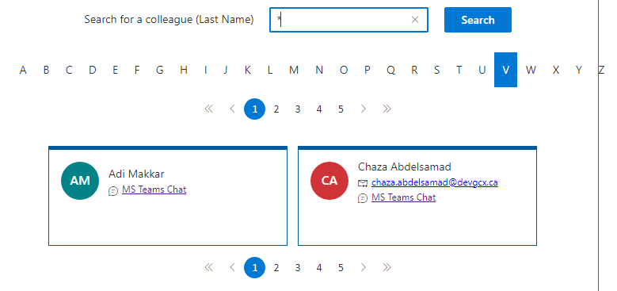
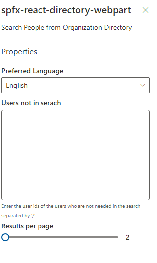

# People Search

## Summary

- The webpart shows all the users in Entra ID.
- Able to search users by their firstname or lastname or both.
- Able to show the users whose firstname or lastname starts with selected letter. Alphabet letters are provided to select.
- Pagination is implemented and able to choose the number of results per page in the Settings/Propertypane.
- Able to change the language (English/French) in the property pane.
- Able to hide any user by entering the user id in the Settings/Propertypane.
- Able to send email and chat with any user.

### Webpart:

### Settings / Property Pane:

## Prerequisites

This web part connects to [this function app](https://github.com/gcxchange-gcechange/appsvc-fnc-createchat-dotnet001).

## API permission

MSGraph

| API / Permissions name    | Type        | Admin consent | Justification                       |
| ------------------------- | ----------- | ------------- | ----------------------------------- |
| Chat.Read | Delegated | Yes | Read user chat messages |
| User.Read | Delegated | Yes | Sign in and read user profile |

Custom

| API / Permissions name    | Type        | Admin consent | Justification                       |
| ------------------------- | ----------- | ------------- | ----------------------------------- |
| access_graph_on_behalf_of_user | Delegated | Yes | Access Microsoft Graph as the signed-in user |

## Version

## Applies to

- [SharePoint Framework](https://aka.ms/spfx)
- [Microsoft 365 tenant](https://docs.microsoft.com/en-us/sharepoint/dev/spfx/set-up-your-developer-tenant)

> Get your own free development tenant by subscribing to [Microsoft 365 developer program](http://aka.ms/o365devprogram)

## Version history

| Version | Date         | Comments                |
| ------- | ------------ | ----------------------- |
| 1.0     | Dec 29, 2022 | Initial release         |
| 1.1     | Nov 21, 2023 | Upgraded to SPFX 1.17.4 |

## Minimal Path to Awesome

- Clone this repository
- Ensure that you are at the solution folder
- To install the dependencies, in the command-line run:
  - **npm install**
- To debug in the front end:
  - go to the `serve.json` file and update `initialPage` to :
    - `https://your-domain-name.sharepoint.com/_layouts/15/workbench.aspx`
  - In the command-line run:
    - **gulp serve**
- To deploy:
  - In the command-line run:
    - **gulp clean**
    - **gulp bundle --ship**
    - **gulp package-solution --ship**
  - Add the webpart to your tenant app store
- Add the Webpart to a page
- Modify the property pane according to your requirements

## Disclaimer

**THIS CODE IS PROVIDED _AS IS_ WITHOUT WARRANTY OF ANY KIND, EITHER EXPRESS OR IMPLIED, INCLUDING ANY IMPLIED WARRANTIES OF FITNESS FOR A PARTICULAR PURPOSE, MERCHANTABILITY, OR NON-INFRINGEMENT.**
